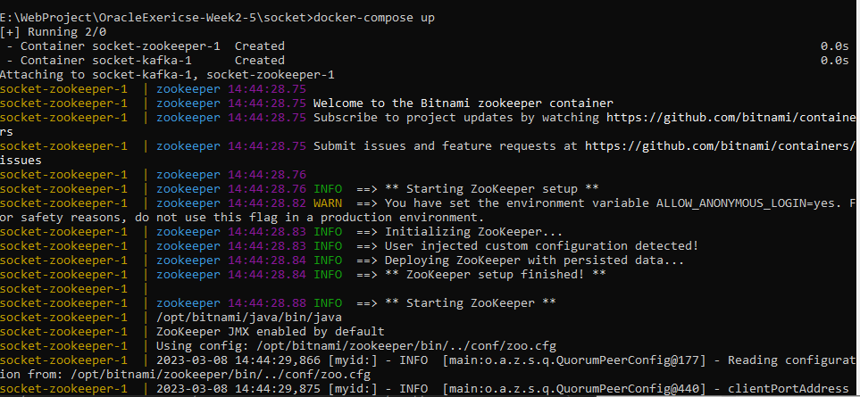
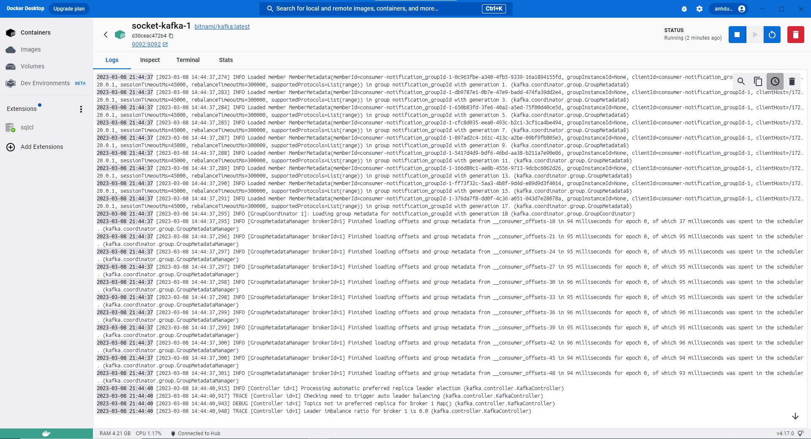

# Redis WebSocket And Kafka Docker Implementation

<a href = "#websocket">Kafka Redis Docker Exercise</a>
---
<a href="#environment">Set Up Environment</a>
---
To use Redis and Kafka, we need to move on some configuration
<br/>
    ```
    docker-compose up
    ```
by using docker-compose.yml
 ```
    version: "3"
    services:
    zookeeper:
    image: 'bitnami/zookeeper:latest'
    ports:
    - '2181:2181'
    environment:
    - ALLOW_ANONYMOUS_LOGIN=yes
    kafka:
    image: 'bitnami/kafka:latest'
    ports:
    - '9092:9092'
    environment:
    - KAFKA_BROKER_ID=1
    - KAFKA_CFG_LISTENERS=PLAINTEXT://:9092
    - KAFKA_CFG_ADVERTISED_LISTENERS=PLAINTEXT://127.0.0.1:9092
    - KAFKA_CFG_ZOOKEEPER_CONNECT=zookeeper:2181
    - ALLOW_PLAINTEXT_LISTENER=yes
    depends_on:
    - zookeeper
 ```
When start the docker-compose file


<br/>
<a>
    <h2>Project Overview</h2>
</a>
---
<h3>Demo Application</h3>
- <h4>Capture message listener kafka when running</h4>
<br/>

<h4>When a new user enter it remain the history the conversations in group</h4>
<br/>

<br/>
- <h4>Create a docker file</h4>

```
FROM openjdk:17-jdk-slim
VOLUME /socket
WORKDIR /app
ARG JAR_FILE=target/socket-0.0.1-SNAPSHOT.jar
COPY ${JAR_FILE} app.jar
ENTRYPOINT ["java","-jar", "/app.jar"]
```
- run ```mvn clean package``` to build JAR file
- run ```docker build -t socket .``` to build image Docker
- run ```docker image ls``` to check the newest built image
- run ```docker run --name socket -p 8080:8080 socket``` to create socket container and run the image

- In this case, I use bitnami/kafka so the code check the topic in kafka
```
  cd var
  cd opt
  kafka-topics.sh --list --bootstrap-server localhost:9092
```


<h3>Dynamic Topic</h3>
Create a configuration for AdminClient in case create a new topic
<br/>

```
@Configuration
public class KafkaDynamicTopic {
    @Value("${spring.kafka.bootstrap-servers}")
    private String bootstrapServers;
    private final Properties props = new Properties();
    @Bean
    public Properties DynamicTopicConfig(){
        props.put(AdminClientConfig.BOOTSTRAP_SERVERS_CONFIG, bootstrapServers);
        return props;
    }
    public void createTopicDynamic(String newTopic) {
        try {
            AdminClient adminClient = AdminClient.create(props);
            NewTopic topic = new NewTopic(newTopic, Collections.emptyMap());
            adminClient.createTopics(Collections.singletonList(topic)).all().get();
        }
        catch (ExecutionException | InterruptedException e){
            if (e.getCause() instanceof TopicExistsException) {
                System.out.println("Topic already exists");
            } else {
                e.printStackTrace();
            }
        }
    }
    public void deleteTopicDynamic(String oldTopic){
        try {
            AdminClient adminClient = AdminClient.create(props);
            adminClient.deleteTopics(Collections.singletonList(oldTopic)).all().get();
        }
        catch (ExecutionException | InterruptedException e){
            if (e.getCause() instanceof TopicExistsException) {
                System.out.println("Topic already exists");
            } else {
                e.printStackTrace();
            }
        }
    }
    public void main(String args[]) {
        createTopicDynamic("newTopicDynamic");
    }
}
```

And configure a Kafka Listener when Producer Register a new Topic
<br/>
```
@Component
public class KafkaListeners {
    @Autowired
    public KafkaDynamicTopic kafkaDynamicTopic;

    @KafkaListener(
            topics = "notification",
            groupId = "notification_groupId"
    )
    void listener(String data){
        System.out.println("Listener received:" + data);
    }

    @KafkaListener(
            topics = "newTopicDynamic",
            groupId = "newTopicDynamic_groupId"
    )
    void listener_newTopic(String data){
        System.out.println("New Topic dynamic" + data);
    }
}
```
Add the send message when the message was sent in Chat

```
 @MessageMapping("/chat.sendMessage/{roomId}")
    @SendTo("/topic/{roomId}")
    public ChatMessage sendMessage(@Payload ChatMessage chatMessage
            , @DestinationVariable String roomId
    ) {
        redisTemplate.opsForList().rightPushAll(roomId, chatMessage);
        kafkaTemplate.send("notification", chatMessage.getContent());
        kafkaTemplate.send("newTopicDynamic", chatMessage.getContent());
        return chatMessage;
    }
```
- Logged out new topic

